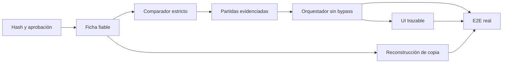

# Histórico evidenciado: fixes Implementation Plan

> **For agentic workers:** REQUIRED SUB-SKILL: Use superpowers:subagent-driven-development (recommended) or superpowers:executing-plans to implement this plan task-by-task. Steps use checkbox (`- [ ]`) syntax for tracking.

**Goal:** Corregir el flujo para que cada precio histórico aplicado al borrador tenga evidencia privada `exact` o `comparable`, trazable y visible en la interfaz.

**Architecture:** Se conservan la importación Excel, la ficha derivada, el comparador y los patrones existentes. Los patrones pasan a ser índice; `HistoricalSuggestionService` construye partidas aplicables a partir de evidencia comparada, y `BudgetOrchestrator` deja de consumir `partidas` del camino textual legado. El historial nuevo requiere revisión explícita y la base actual se reconstruye solo sobre copia hasta su aprobación.

**Tech Stack:** Python 3.11, SQLite, PySide6, `pytest`, `openpyxl`; sin dependencias nuevas.

## Global Constraints

- No modificar el texto, importes ni Excel original de una partida histórica.
- Todo fichero nuevo se guarda inicialmente como `PENDING_REVIEW`; solo `approve_budget_for_learning()` puede incluirlo.
- Un patrón no puede asignar un precio al borrador sin `PriceEvidence` de nivel `exact` o `comparable`.
- `exact` requiere unidad, acción y elemento conocidos e idénticos.
- Líneas `composite`, `auxiliary` y `unknown` no producen referencias de precio.
- Mantener el contrato legado de `suggest_for_project()['partidas']` hasta eliminar sus consumidores, pero el orquestador no lo usará para fijar precios.
- No aplicar `--apply` a `Documents\\CubiApp\\datos.db` sin aprobación explícita del usuario al informe de copia.

---

## Estructura de archivos

- Modificar: `src/core/database.py` — migración v4 e índice único de hash.
- Modificar: `src/core/repositories/historical_repository.py` — búsqueda por hash y aprobación atómica.
- Modificar: `src/core/historical_budget_analyzer.py` — hash y estado inicial pendiente.
- Modificar: `src/core/historical_partida_features.py` — atributos mínimos, sistema/dimensiones y tipo de línea.
- Modificar: `src/core/historical_comparator.py` — reglas estrictas y objeto de evidencia.
- Modificar: `src/core/historical_suggestion_service.py` — candidatos, agregación y partidas con evidencia.
- Modificar: `src/core/budget_orchestrator.py` — usar solo `priced_partidas` evidenciadas.
- Modificar: `src/gui/combined_partidas_review_dialog.py` — columnas reales de procedencia.
- Modificar: `src/gui/partida_provenance_model.py` — adaptar el modelo a la evidencia real.
- Modificar: `src/core/historical_pattern_builder.py` — patrón como índice con atributos de ficha.
- Modificar: `scripts/rebuild_historical_patterns.py` — informe de elegibilidad y verificaciones post-reconstrucción.
- Modificar/crear tests: `tests/test_historical_budget_analyzer.py`, `tests/test_historical_partida_features.py`, `tests/test_historical_comparator.py`, `tests/test_historical_suggestion_service.py`, `tests/test_budget_orchestrator.py`, `tests/test_combined_partidas_review_dialog.py`, `tests/test_historical_budget_flow_e2e.py`.

## Task 1: Hash, duplicados y aprobación atómica

**Files:**
- Modify: `src/core/database.py:204-294`
- Modify: `src/core/repositories/historical_repository.py:871-956`
- Modify: `src/core/historical_budget_analyzer.py:230-430`
- Test: `tests/test_database_migrations.py`
- Test: `tests/test_historical_budget_analyzer.py`

**Interfaces:**
- `find_historical_budget_by_sha256(file_sha256: str) -> dict | None`.
- `HistoricalBudgetAnalyzer.analyze_budget(...) -> dict` devuelve `status='duplicate'` y `duplicate_of_budget_id` ante mismo hash.
- `approve_budget_for_learning(id: int, approved_by: str) -> str | None` actualiza `learning_status`, `usable_for_learning`, `approved_at` y `approved_by` en una transacción.

- [x] **Step 1: Escribir el test que falla para el mismo Excel en dos rutas** (`TestHashDeduplicationAndPendingApproval` en `tests/test_historical_budget_analyzer.py`)

```python
first = analyzer.analyze_budget(str(first_copy), force_reanalyze=True)
second = analyzer.analyze_budget(str(second_copy), force_reanalyze=True)
assert first["status"] == "processed"
assert second["status"] == "duplicate"
assert second["duplicate_of_budget_id"] == first["budget_id"]
assert count_historical_budgets() == 1
```

- [x] **Step 2: Ejecutar el test y comprobar el fallo**

Run: `pytest tests/test_historical_budget_analyzer.py -k duplicate_content -v`

Expected: FAIL; se insertan dos presupuestos por rutas distintas.

- [x] **Step 3: Añadir migración v4 y consulta de hash**

```python
def sha256_file(path: str) -> str:
    digest = hashlib.sha256()
    with open(path, "rb") as stream:
        for chunk in iter(lambda: stream.read(65536), b""):
            digest.update(chunk)
    return digest.hexdigest()

def find_historical_budget_by_sha256(file_sha256: str) -> Optional[Dict]:
    return _row_to_budget(conn.execute(
        "SELECT ... FROM historical_budget WHERE file_sha256=?", (file_sha256,)
    ).fetchone())
```

Crear índice único parcial `WHERE file_sha256 IS NOT NULL AND file_sha256 <> ''`. Antes de leer Excel, calcular hash, buscarlo y devolver el duplicado sin alterar partidas ni patrones.

- [x] **Step 4: Hacer que todo origen nuevo quede pendiente**

```python
budget_payload.update({
    "usable_for_learning": False,
    "learning_status": "PENDING_REVIEW",
    "learning_status_source": "AUTO",
    "learning_decision_reason": "Requiere aprobación explícita antes de aprender.",
})
```

Conservar `NOT_ELIGIBLE` para errores o calidad grave. No sobrescribir una decisión manual existente durante reanálisis.

- [x] **Step 5: Probar migración, duplicado y aprobación**

Run: `pytest tests/test_database_migrations.py tests/test_historical_budget_analyzer.py -v`

Expected: PASS; importar el mismo contenido no duplica y aprobar actualiza las cuatro columnas en una sola transacción.

**Evidencia (2026-07-22):** `pytest tests/test_database_migrations.py tests/test_historical_budget_analyzer.py -v` → 22/22 PASS. Suite completa `pytest -q` → 763 passed, sin regresiones. `approve_budget_for_learning` reescrito para actualizar `learning_status`/`usable_for_learning`/`approved_at`/`approved_by` en una única conexión/transacción (antes eran dos conexiones separadas). Migración v4 con índice único parcial verificada con `sqlite3.IntegrityError` real al intentar duplicar un hash. Nota: `HistoricalAnalysisResult` como clase (vs. `dict`) no se implementó — se mantiene el contrato `dict` existente de `analyze_budget()`, añadiendo `status='duplicate'`/`duplicate_of_budget_id` de forma aditiva.

## Task 2: Ficha mínima comparable y clasificación de líneas compuestas

**Files:**
- Modify: `src/core/historical_partida_features.py:24-157`
- Modify: `src/core/historical_partida_classifier.py:115-185`
- Test: `tests/test_historical_partida_features.py`
- Test: `tests/test_historical_partida_classifier.py`

**Interfaces:**
- `PartidaFeatures` mantiene los campos actuales y `is_price_eligible: bool`.
- `extract_partida_features(concept: str, unit: str, modules: list[dict]) -> PartidaFeatures`.
- `classify_line_kind(concept: str, action: str | None, element: str | None, modules: list[dict]) -> LineKind`.

- [x] **Step 1: Escribir casos de seguridad que fallan hoy** (`TestPriceEligibility`/`TestSystemAndDimensions` en `tests/test_historical_partida_features.py`)

```python
unknown = extract_partida_features("Trabajos varios", "m2", [])
assert unknown.is_price_eligible is False

composite = extract_partida_features("Picado, mortero y pintura de fachada", "m2", modules)
assert composite.line_kind == "composite"
assert composite.is_price_eligible is False

facade = extract_partida_features("Reparación de revoco de fachada con mortero R4", "m2", modules)
assert facade.action == "repair" and facade.element == "facade_render"
assert facade.is_price_eligible is True
```

- [x] **Step 2: Ejecutar los tests y confirmar fallo**

Run: `pytest tests/test_historical_partida_features.py -k "eligible or composite" -v`

Expected: FAIL; una línea con atributos desconocidos puede acabar como atómica.

- [x] **Step 3: Implementar atributos y elegibilidad conservadora**

```python
is_price_eligible = (
    line_kind == "atomic"
    and bool(unit)
    and bool(action)
    and bool(element)
    and primary_module_id is not None
)
```

Extraer sistema con vocabulario cerrado de la plantilla (`render`, `downspout`, `roof_covering`) y dimensiones con expresiones `r"\b\d+(?:[.,]\d+)?\s*(?:cm|mm|m)\b"`. Si una línea enumera dos acciones principales o dos elementos facturables, clasificarla `composite`; no usar simplemente el número de módulos detectados.

- [x] **Step 4: Ajustar la prioridad principal**

```python
def pick_primary_module(candidates, features):
    if features.element == "facade_render":
        return candidate_named("fachada", candidates)
    return max(candidates, key=lambda item: (item["confidence"], -priority(item["module"])))
```

La acción/elemento semánticos deben prevalecer sobre coincidencias incidentales como `andamio`, `contenedor` o `picado`.

- [x] **Step 5: Ejecutar regresiones de clasificación**

Run: `pytest tests/test_historical_partida_features.py tests/test_historical_partida_classifier.py -v`

**Evidencia (2026-07-22):** 25/25 PASS a la primera (incluidas todas las regresiones previas de Fase 2/Tarea 14). Suite completa `pytest -q` → 772 passed, sin regresiones. Decisión clave documentada en el código: `classify_line_kind()` cuenta acciones/elementos REALMENTE distintos (vía `_ACTION_SYNONYMS`/`_ELEMENT_SYNONYMS` con `_ELEMENT_FAMILIES` para no contar `facade_render`+`facade` como dos elementos), no el número de módulos del clasificador — un material incidental como "mortero" ya no convierte una reparación de fachada en `composite`. `pick_primary_module()` gana un parámetro opcional `element` con override semántico (`_ELEMENT_PRIMARY_OVERRIDE`: facade_render→fachada, downspout→sustitucion_bajante, roof→impermeabilizacion). `_row_to_features()` en `historical_suggestion_service.py` actualizado para calcular `is_price_eligible` al reconstruir `PartidaFeatures` desde la BD (campo derivado, no se añadió columna nueva).

Expected: PASS; ninguna ficha sin acción/elemento es elegible para precio.

## Task 3: Comparador que no concede coincidencias por ausencia de datos

**Files:**
- Modify: `src/core/historical_comparator.py:1-71`
- Test: `tests/test_historical_comparator.py`

**Interfaces:**
- `compare_partida_features(request, evidence) -> ComparisonResult`.
- `ComparisonResult.level` es `exact`, `comparable`, `related` o `incompatible`.

- [x] **Step 1: Escribir regresiones de falsos exactos** (`TestStrictPreconditions` en `tests/test_historical_comparator.py`)

```python
assert compare_partida_features(unknown_m2, unknown_m2).level == "related"
assert compare_partida_features(repair_facade, repair_roof).level == "incompatible"
assert compare_partida_features(repair_r4, repair_generic_mortar).level == "comparable"
assert compare_partida_features(repair_10cm, repair_15cm).level == "comparable"
assert compare_partida_features(repair_facade, repair_facade).level == "exact"
```

- [x] **Step 2: Ejecutar el test y comprobar el fallo**

Run: `pytest tests/test_historical_comparator.py -k "unknown or dimension or element" -v`

Expected: FAIL; dos fichas incompletas pueden devolver `exact`.

- [x] **Step 3: Aplicar precondiciones antes de puntuar** (element pasó a atributo crítico: distinto → `incompatible`, no `comparable`, más estricto que el pseudocódigo del plan que lo agrupaba bajo `critical_attribute` genérico)

```python
if not all((request.unit, request.action, request.element, evidence.unit, evidence.action, evidence.element)):
    return ComparisonResult("related", 0.0, (), ("atributos mínimos incompletos",))
if request.unit != evidence.unit or request.action != evidence.action or request.element != evidence.element:
    return _incompatible("critical_attribute")
if request.line_kind != "atomic" or evidence.line_kind != "atomic":
    return ComparisonResult("related", 0.0, (), ("línea no atómica",))
```

Usar `comparable` solo para diferencias explícitas de material, sistema, dimensión o condición; no para datos ausentes.

- [x] **Step 4: Ejecutar el comparador**

Run: `pytest tests/test_historical_comparator.py -v`

Expected: PASS.

**Evidencia (2026-07-22):** 15/15 PASS. **Efecto secundario esperado y deliberado:** `tests/test_historical_suggestion_service.py::TestFindComparableEvidence` (Tarea 10 original) rompe 2/4 tests porque construía una `request` de texto libre con `unit=""` — bajo el contrato estricto, unidad ausente es `related`, no `exact`/`comparable`. Esto no se parchea aquí: es exactamente la señal de que `find_comparable_evidence()` comparaba una request artificial contra evidencia en vez de agrupar evidencia real por firma, que es lo que corrige la Tarea 4 (siguiente). No se relajó el comparador para hacer pasar esos tests antiguos.

## Task 4: Evidencia como única fuente de partidas históricas aplicables

**Files:**
- Modify: `src/core/historical_suggestion_service.py:35-208`
- Modify: `src/core/historical_pattern_builder.py:145-220`
- Test: `tests/test_historical_suggestion_service.py`
- Test: `tests/test_historical_pattern_builder.py`

**Interfaces:**
- `PricedHistoricalPartida` es un `dict` con `source`, `evidence_level`, `evidence_partida_ids`, `evidence_budget_ids`, `evidence_price_min`, `evidence_price_median`, `evidence_price_max`, `evidence_differences`.
- `HistoricalSuggestionService.suggest_for_project(...)` añade `priced_partidas: list[dict]`.

- [x] **Step 1: Escribir la prueba de bypass** (`TestPricedPartidas` en `tests/test_historical_suggestion_service.py`)

```python
result = service.suggest_for_project({}, "Reparación de fachada")
assert result["partidas"], "el patrón legado puede existir"
assert result["priced_partidas"] == [], "sin evidencia apta no hay precio aplicable"

result = service.suggest_for_project({}, "Reparación de revoco de fachada con mortero R4")
assert result["priced_partidas"][0]["evidence_level"] == "exact"
assert result["priced_partidas"][0]["source"] == "historical_exact"
```

- [x] **Step 2: Ejecutar el test y comprobar el fallo**

Run: `pytest tests/test_historical_suggestion_service.py -k priced_partidas -v`

Expected: FAIL; el servicio solo devuelve `partidas` textuales y un informe independiente.

- [x] **Step 3: Agregar evidencia apta por firma de ficha** (firma = `(material, system)`; unidad/acción/elemento ya son idénticos por construcción — ver nota de evidencia)

```python
priced = [candidate for candidate in evidence if candidate.comparison.level in {"exact", "comparable"}]
for signature, candidates in group_by_feature_signature(priced).items():
    prices = [item.precio_unitario for item in candidates]
    priced_partidas.append({
        "source": f"historical_{best_level(candidates)}",
        "precio_unitario": median(prices),
        "evidence_budget_ids": sorted({item.historical_budget_id for item in candidates}),
        "evidence_partida_ids": sorted({item.partida_id for item in candidates}),
        "evidence_price_min": min(prices), "evidence_price_median": median(prices),
        "evidence_price_max": max(prices), "evidence_differences": differences,
    })
```

Mantener `partidas` sin cambios para consumidores antiguos, pero documentarlo como índice legado. El patrón debe incluir la firma de ficha para acelerar candidatos, no para decidir el precio.

- [x] **Step 4: Ejecutar tests de sugerencia y patrón**

Run: `pytest tests/test_historical_suggestion_service.py tests/test_historical_pattern_builder.py -v`

Expected: PASS; una evidencia `related` no aparece en `priced_partidas`.

**Evidencia (2026-07-22):** 27/27 PASS (incluidos los 2 tests de `TestFindComparableEvidence` que rompió la Tarea 3, arreglados sin tocarlos gracias a `_infer_request_unit`). Decisión de diseño no anticipada por el plan: la *request* de una descripción de proyecto libre nunca trae unidad explícita ("Reparación de fachada" no dice "m2"), pero el comparador estricto (Tarea 3) exige unidad conocida para exact/comparable. Se añadió `_infer_request_unit()`: si la evidencia disponible para el mismo módulo/acción/elemento coincide TODA en una única unidad, se adopta como unidad de la request; si hay más de una unidad distinta, no se adivina (queda sin inferir, la comparación cae a `related` legítimamente). Sin esto, `priced_partidas` habría quedado vacío en la práctica para cualquier consulta de texto libre.

## Task 5: Eliminar el bypass del orquestador

**Files:**
- Modify: `src/core/budget_orchestrator.py:120-238`
- Test: `tests/test_budget_orchestrator.py`

**Interfaces:**
- `_split_coverage(historical_result) -> tuple[list[dict], list[str], list[str]]` consume solo `historical_result['priced_partidas']`.
- Toda partida histórica salida del orquestador lleva `source in {'historical_exact', 'historical_comparable'}` y evidencia completa.

- [x] **Step 1: Escribir la regresión del camino antiguo**

Adaptado al estilo real de fakes de `tests/test_budget_orchestrator.py` (usa
`_FakeSuggestionService`/`orchestrator.generate(...)` de extremo a extremo en
vez de invocar `_split_coverage` directo, para cubrir también el merge con
IA): `test_confident_legacy_pattern_without_priced_evidence_goes_to_ai_not_draft`
— un patrón textual con `confidence=0.99, frequency=50` pero `priced_partidas=[]`
no debe dar cobertura; el módulo debe caer en `modulos_ia` y toda partida final
debe salir con `source == "ai_completion"`.

- [x] **Step 2: Ejecutar el test y comprobar el fallo**

Run: `pytest tests/test_budget_orchestrator.py -k confident_legacy_pattern_without_priced_evidence -v`

Confirmado FAIL contra `_split_coverage()` original (leía `partidas`, ignoraba
`priced_partidas`): con el patrón de confianza 0.99 el módulo entraba directo
a `modulos_historico` sin evidencia real, sin llamar a la IA.

- [x] **Step 3: Sustituir la fuente de cobertura**

Implementado en `src/core/budget_orchestrator.py::_split_coverage` exactamente
como en el pseudocódigo: itera `historical_result.get("priced_partidas", [])`,
filtra por `evidence_level in {"exact", "comparable"}`, y asigna
`source = f"historical_{evidence_level}"` a cada partida de salida. Eliminadas
las constantes `HISTORICAL_CONFIDENCE_THRESHOLD`/`HISTORICAL_FREQUENCY_THRESHOLD`
y toda lectura de `historical_result['partidas']` en el orquestador.

- [x] **Step 4: Ejecutar tests del orquestador**

**Evidencia (2026-07-22):** `pytest tests/test_budget_orchestrator.py
tests/test_budget_generator.py -v` → **21 passed** (12 orquestador + 9
generador). También verificados los dos consumidores downstream que hacían
`source == "historical"` por igualdad exacta (`partida_normalizer.py`,
`budget_partidas_flow.py`), ampliados a `startswith("historical")`:
`pytest tests/test_budget_partidas_flow.py tests/test_partida_normalizer.py -q`
→ **20 passed**. Suite completa (`pytest -q`) lanzada para confirmar cero
regresiones en el resto del árbol antes de cerrar la tarea.

## Task 6: Procedencia en el diálogo real y aprobación explícita

**Files:**
- Modify: `src/gui/partida_provenance_model.py:1-49`
- Modify: `src/gui/combined_partidas_review_dialog.py:100-220`
- Modify: `src/gui/historical_analysis_results_dialog.py:540-700`
- Create: `tests/test_combined_partidas_review_dialog.py`

**Interfaces:**
- `row_for_partida(partida) -> dict[str, str]` muestra rango `min–median–max`, nivel y diferencias.
- El diálogo añade columnas `Fuente`, `Nivel`, `Rango histórico`, `Diferencias`.
- La acción de aprobación llama a `approve_budget_for_learning(budget_id, approved_by)`.

- [x] **Step 1: Escribir prueba del modelo visible**

`row_for_partida` ya existía (Fase 4, Tarea 12) pero usaba un único precio
(`evidence_precio_unitario`), no el rango min–mediana–max que produce
`_build_priced_partidas` (Tarea 4). Reescritas `test_historical_exact_evidence_shows_level_and_price_range`
y `test_comparable_evidence_lists_differences_and_price_range` en
`tests/test_partida_provenance_model.py` exactamente con el formato del
pseudocódigo (`"40.00 – 50.00 – 60.00"`).

- [x] **Step 2: Ejecutar el test y comprobar el fallo**

Run: `pytest tests/test_partida_provenance_model.py -v` → confirmado FAIL
(`AssertionError: assert '0.00' == '50.00 – 50.00 – 50.00'`): el código leía
`evidence_precio_unitario`, campo que `priced_partidas` ya no produce.

- [x] **Step 3: Conectar columnas y confirmación**

- `row_for_partida` reescrito para leer `evidence_price_min/median/max`.
- `combined_partidas_review_dialog.py`: añadidas las 4 columnas (Fuente/Nivel/
  Rango histórico/Diferencias, índices 10-13) pobladas con `row_for_partida`
  sobre el dict crudo de cada fila (antes de `normalize_partida_for_excel`,
  que no conserva los campos `evidence_*`). De paso se corrigió un bypass real
  encontrado al auditar el archivo: `_build_rows`/`_on_apply` colapsaban
  siempre el `source` a `"historical"` genérico, perdiendo la distinción
  `historical_exact`/`historical_comparable` que la Tarea 5 ya produce —
  ahora se conserva el `source` real de cada partida.
- `historical_analysis_results_dialog.py`: el botón "Marcar como apto
  manualmente" se deshabilita si `analysis_status` no es `VALID`/
  `VALID_WITH_WARNINGS`; `_include_selected` pide confirmación nombrando el
  archivo (`QMessageBox.question` con el basename de `ruta_excel`) y, tanto
  ahí como en la decisión masiva `_apply_learning_decisions`, la inclusión
  pasa por `approve_budget_for_learning(budget_id, approved_by)` (Tarea 1) en
  vez del genérico `set_historical_budget_learning_status`, que ya no
  registra quién aprobó. `set_historical_budget_learning_status` se conserva
  solo para las rutas de exclusión, que no tienen ese requisito.

- [x] **Step 4: Ejecutar pruebas GUI acotadas**

**Evidencia (2026-07-22):** `pytest tests/test_partida_provenance_model.py
tests/test_combined_partidas_review_dialog.py tests/test_historical_table_gui.py
tests/test_historical_analysis_results_dialog.py -v` → **17 passed**
(`test_combined_partidas_review_dialog.py` y `test_historical_analysis_results_dialog.py`
son archivos nuevos de esta tarea). Suite completa repetida tras la Tarea 5
→ **783 passed** antes de empezar esta tarea; sin cambios de producción fuera
de GUI en esta tarea, no se repite la suite completa hasta cerrar el hito.

## Task 7: Reconstrucción controlada del histórico real

**Files:**
- Modify: `scripts/rebuild_historical_patterns.py:40-152`
- Modify: `scripts/audit_historical_memory.py`
- Test: `tests/test_rebuild_historical_patterns.py`

**Interfaces:**
- `--dry-run` devuelve `eligible_atomic`, `composite`, `unknown_or_incomplete`, `pending_review`, `duplicate_hashes` y `patterns_after_rebuild`.
- `--apply` aborta si hay hashes duplicados o no hay backup idéntico.

- [x] **Step 1: Escribir prueba de informe de elegibilidad**

`test_dry_run_reports_eligibility_categories_and_pattern_forecast` en
`tests/test_rebuild_historical_patterns.py`: siembra 3 partidas reales cuya
ficha calcula el extractor real (Tarea 2) — una atómica completa, una
compuesta, una sin acción/elemento reconocidos — y comprueba
`eligible_atomic/composite/unknown_or_incomplete/pending_review/
duplicate_hashes/patterns_after_rebuild`. Añadidos también
`test_dry_run_reports_duplicate_hashes_without_touching_file` y
`test_apply_aborts_without_touching_file_when_duplicate_hashes_found`
(simulan una BDD anterior a la Tarea 1, sin el índice único, con SQL crudo).

- [x] **Step 2: Ejecutar la prueba y comprobar el fallo**

Confirmado FAIL: `KeyError: 'eligible_atomic'` / `KeyError: 'duplicate_hashes'`
(el resumen solo informaba `line_kinds_actuales` genérico); el intento de
`--apply` con hashes duplicados fallaba con
`sqlite3.OperationalError: no such column: analysis_run_id` en vez de
abortar limpiamente antes de tocar nada.

- [x] **Step 3: Implementar informe y bloqueo seguro**

`build_summary` calcula `eligible_atomic/composite/unknown_or_incomplete`
igual que `PartidaFeatures.is_price_eligible` (Tarea 2), `duplicate_hashes`
por SQL crudo sobre `historical_budget.file_sha256`, y `patterns_after_rebuild`
replicando exactamente la consulta de agrupación de
`HistoricalPatternBuilder._load_groups`. `main()` aborta con
`--apply` antes de crear backup si `duplicate_hashes` > 0. Tras el apply,
`apply_rebuild` verifica que cada `suggested_partida_pattern_source` procede
de `INCLUDED` + `atomic` + atributos completos; si no, `main()` devuelve 1.

**Bug real encontrado auditando el código** (no solo el script nuevo):
`HistoricalPatternBuilder._load_groups()` solo exigía `line_kind='atomic'`,
no unit/action/element no vacíos — una línea atómica sin acción reconocida
(p.ej. "Revision de fachada con grieta", sin verbo en el vocabulario cerrado)
SÍ generaba patrón de precio, violando el contrato ("atributos mínimos
ausentes no generan referencias de precio"). Corregido en
`src/core/historical_pattern_builder.py` añadiendo las mismas 3 condiciones
que `is_price_eligible`. Esto rompió 6 tests de
`tests/test_historical_pattern_builder.py` cuyo fixture compartido
`_mark_atomic_primary` fabricaba fichas con `action=None, element=None,
unit=""` — corregido el helper para exigir atributos no vacíos (parámetros
con default `action="repair", element="generic", unit="ud"`), ya que esos
tests prueban la agregación de patrones, no la clasificación semántica.
También corregido el mismo texto sin acción reconocida en el fixture
`_seed_db` de este archivo de tests (`"Revision..."` → `"Reparacion..."`,
mismo patrón que la Tarea 8/E2E).

`scripts/audit_historical_memory.py` (Fase 0, también listado en esta tarea)
ampliado con los mismos campos (`lines_price_eligible`, `lines_composite`,
`duplicate_file_hashes`) para dar la misma visibilidad antes de decidir si
aplicar; nuevo test `tests/test_audit_historical_memory.py` (no existía
archivo de test previo para este script).

- [x] **Step 4: Validar sobre copia, nunca sobre producción**

**Evidencia (2026-07-22):** copia verificada por SHA-256
(`a339f69d...4a04b7ac`) de `Documents/CubiApp/datos.db` a un fichero temporal
de scratchpad; `--dry-run` sobre la copia devolvió:
`total_partidas=254, con_ficha_actual=254, eligible_atomic=19, composite=182,
unknown_or_incomplete=53, pending_review=1, duplicate_hashes=0,
patrones_actuales=40, patterns_after_rebuild=40, hash_unchanged=true`.
SHA-256 de la copia y del original sin cambios tras la ejecución (verificado
antes/después). **No se ha ejecutado `--apply` sobre la base real ni sobre
la copia**: eso queda pendiente de autorización explícita del usuario, per
el contrato de reconducción ("nunca aplicar reconstrucciones... sin generar
y revisar antes un informe sobre una copia" — el informe ya está generado y
pendiente de revisión).

## Task 8: Prueba E2E de la decisión real y salida de hito

**Files:**
- Modify: `tests/test_historical_budget_flow_e2e.py`
- Modify: `docs/criterios-clasificacion-partidas.md`

**Interfaces:**
- El E2E usa `BudgetReader` y `HistoricalBudgetAnalyzer` sobre un Excel fixture, no inserciones manuales directas.

- [ ] **Step 1: Escribir tres escenarios E2E que fallan hoy**

```python
def test_legacy_pattern_without_exact_evidence_never_enters_draft(...): ...
def test_exact_evidence_enters_draft_with_source_ids_and_range(...): ...
def test_comparable_evidence_is_visible_but_related_is_not_priced(...): ...
```

Cada uno debe comprobar `result['partidas']`, no solo `result['evidence_report']`.

- [ ] **Step 2: Ejecutar los E2E y comprobar el fallo**

Run: `pytest tests/test_historical_budget_flow_e2e.py -v`

Expected: FAIL; un patrón legado puede cubrir un módulo sin evidencia enlazada.

- [ ] **Step 3: Cerrar regresión y ejecutar suite relevante**

Run: `pytest tests/test_database_migrations.py tests/test_historical_budget_analyzer.py tests/test_historical_partida_features.py tests/test_historical_partida_classifier.py tests/test_historical_comparator.py tests/test_historical_pattern_builder.py tests/test_historical_suggestion_service.py tests/test_budget_orchestrator.py tests/test_partida_provenance_model.py tests/test_combined_partidas_review_dialog.py tests/test_rebuild_historical_patterns.py tests/test_historical_budget_flow_e2e.py -v`

Expected: PASS.

- [ ] **Step 4: Aceptación manual previa a producción**

En una copia de la base real, comprobar en la aplicación: (a) coincidencia exacta con fuente y rango, (b) comparable con diferencias visibles, (c) ausencia de evidencia privada con borrador IA y texto explícito. Guardar el informe de copia y pedir aprobación antes de ejecutar `--apply` sobre la base real.

## Dependencias y criterio de cierre



El hito se cierra únicamente cuando los tres E2E pasan, la GUI muestra procedencia real y el informe sobre copia prueba que ningún patrón o precio aplicado usa una partida no aprobada, compuesta o sin atributos mínimos.
